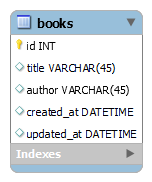

# checklist

- [x] create a new directory
- [ ] inside the directory create virtural env by running:

```bash
[python -m] pipenv install flask pymysql
```

- [ ] activate the virtual env every time you open a new terminal:

```bash
[python -m] pipenv shell 
```
## Create File structure

- [ ] create [server.py](server.py)

```py
# server.py
from flask_app import app
import flask_app.controllers.books

if __name__=="__main__":       
    app.run(debug=True)  
```

### create `flask_app` package
- [ ] create [`config`](flask_app/config/mysqlconnection.py) folder for DB config
- [ ] create [`models`](flask_app/models/book.py) folder for models
- [ ] create [`controllers`](flask_app/controllers/books.py) folder for controllers/routes
- [ ] create [`static`](flask_app/static/css/style.css) folder for front-end resources
- [ ] create [`templates`](flask_app/templates/index.html) folder for views
- [ ] create [`__init__.py`](flask_app/__init__.py) to hold imports and app.

```py
# __init__.py
from flask import Flask, render_template, redirect, request  

app = Flask(__name__)
```  


- [ ] start application by running:

```
python server.py
```

- [ ] go to [localhost:5000](http://localhost:5000/)


## Connect to a database

- [ ] create ERD: 
 
    

- [ ] install the module to connect Flask to mysql:

```bash
[python -m] pipenv install pymysql
```
